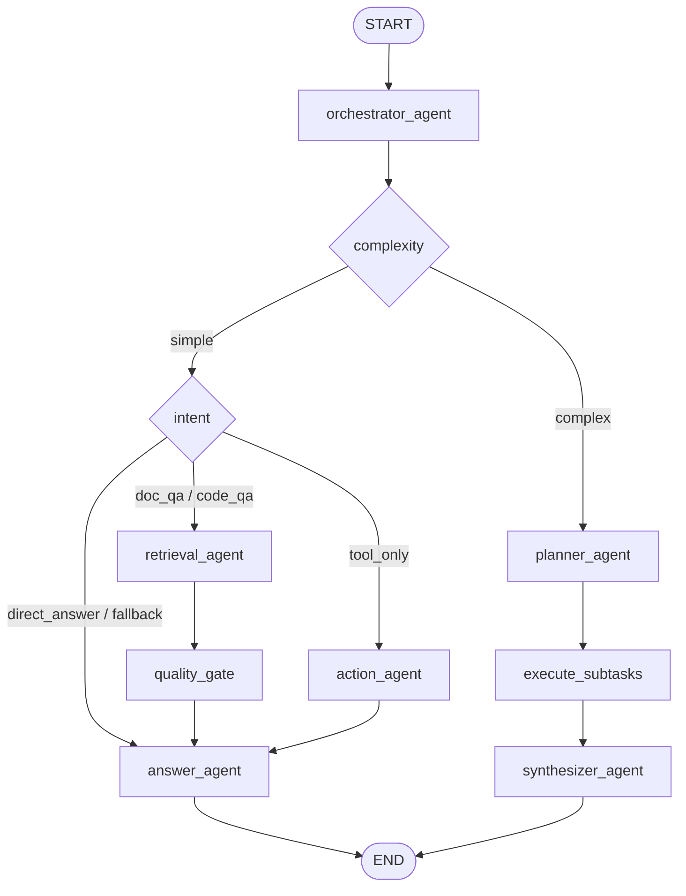

# 当前 Multi-Agent 结构图（v2）

在原 5 Agent 基础上引入了 **Planner → Executor → Synthesizer** 复杂任务链路，并增加了 **Quality Gate** 质量检查节点。



## 节点职责

- **orchestrator_agent**（`orchestrator_agent.py`）
  - 读取用户输入，调用 LLM 判断意图（intent）和复杂度（complexity）
  - 简单任务按 intent 分流到 retrieval / action / answer
  - 复杂任务（complex）分流到 planner 做子任务分解
  - 输出 JSON：`{intent, complexity, reason}`

- **planner_agent**（`planner_agent.py:69`）
  - 将复杂用户问题分解为 2-5 个有序子任务（sub_tasks）
  - 每个子任务标注 sub_intent 和 depends_on 依赖关系
  - 分解失败时降级为单一子任务直接处理原问题

- **execute_subtasks**（`planner_agent.py:137`）
  - 按拓扑序逐个执行子任务，复用现有 agent 节点（retrieval → quality_gate → answer / action → answer）
  - 将前置子任务的结果注入后续子任务的查询上下文
  - 结果写入 `plan_results`

- **synthesizer_agent**（`synthesizer_agent.py:16`）
  - 将 `plan_results` 中各子任务的碎片化结果综合为一份完整回答
  - 调用 LLM 做去重、调和、串联，输出最终答案
  - LLM 调用失败时降级为直接拼接

- **retrieval_agent**（`retrieval_agent.py`）
  - 封装 RAG 检索能力：query_rewrite → hybrid_retrieval → rerank → build_context
  - 输出检索证据列表和拼接后的上下文文本

- **quality_gate**（`quality_gate.py`）
  - 检查检索结果质量，标记 `passed` / `degraded_empty` / `degraded_low_score`
  - 决定 answer_agent 是走 RAG 模式还是降级模式

- **action_agent**（`action_agent.py`）
  - 负责工具调用（pg_query、tavily_search）
  - 支持多轮工具调用，达到上限后强制总结
  - 输出 action_history 和 action_summary

- **answer_agent**（`answer_agent.py`）
  - 统一组织最终回复
  - 根据 intent、quality、action_results 选择不同的 system prompt
  - 接收 RAG 证据、工具结果或降级结果

## 核心数据流（SupportAgentState）

```python
# graph/state.py — 所有节点共享的统一状态
class SupportAgentState(TypedDict):
    session_id: str
    user_query: str
    normalized_query: str
    intent: IntentType          # orchestrator 写入
    complexity: ComplexityType   # orchestrator 写入，决定走 planner 还是直接分流
    route_reason: str
    plan: PlanPayload            # planner 写入
    plan_results: list[SubTask]  # execute_subtasks 写入
    synthesized_answer: str      # synthesizer 写入
    retrieval: RetrievalPayload  # retrieval_agent 写入
    quality: QualityType         # quality_gate 写入
    action_history: list[ActionPayload]  # action_agent 写入
    action_summary: str
    answer: str                  # answer_agent 或 synthesizer 最终写入
    error: str
```

## 两条主链路

| 链路 | 路径 | 适用场景 |
|------|------|----------|
| 简单任务 | orchestrator → retrieval/action → quality_gate → answer → END | 单一问题，可直接检索或工具执行 |
| 复杂任务 | orchestrator → planner → execute_subtasks → synthesizer → END | 多子问题、跨来源整合、多步推理 |

## 和 v1（初步设计）的主要变化

1. **新增 complexity 判断**：orchestrator 不仅判断 intent，还判断 simple/complex，决定是否走 planner 分解
2. **新增 Planner + Executor + Synthesizer**：复杂任务先分解再汇总，避免单次检索无法覆盖多步问题
3. **新增 quality_gate**：检索结果先过质量检查再进 answer，支持 passed/degraded 两种回答模式
4. **memory_agent 未接入**：prompt 已定义（`MEMORY_SYSTEM_PROMPT`），但 graph 中尚未作为节点接入
5. **action_agent 已实现**：支持 pg_query + tavily_search 多轮工具调用

## 文件映射

| Agent | 文件 |
|-------|------|
| orchestrator | `supportAgents/agents/orchestrator_agent.py` |
| planner | `supportAgents/agents/planner_agent.py` |
| synthesizer | `supportAgents/agents/synthesizer_agent.py` |
| retrieval | `supportAgents/agents/retrieval_agent.py` |
| quality_gate | `supportAgents/agents/quality_gate.py` |
| action | `supportAgents/agents/action_agent.py` |
| answer | `supportAgents/agents/answer_agent.py` |
| prompts（全部） | `supportAgents/agents/prompts.py` |
| 状态定义 | `supportAgents/graph/state.py` |
| Graph 编排 | `supportAgents/graph/builder.py` |
```

