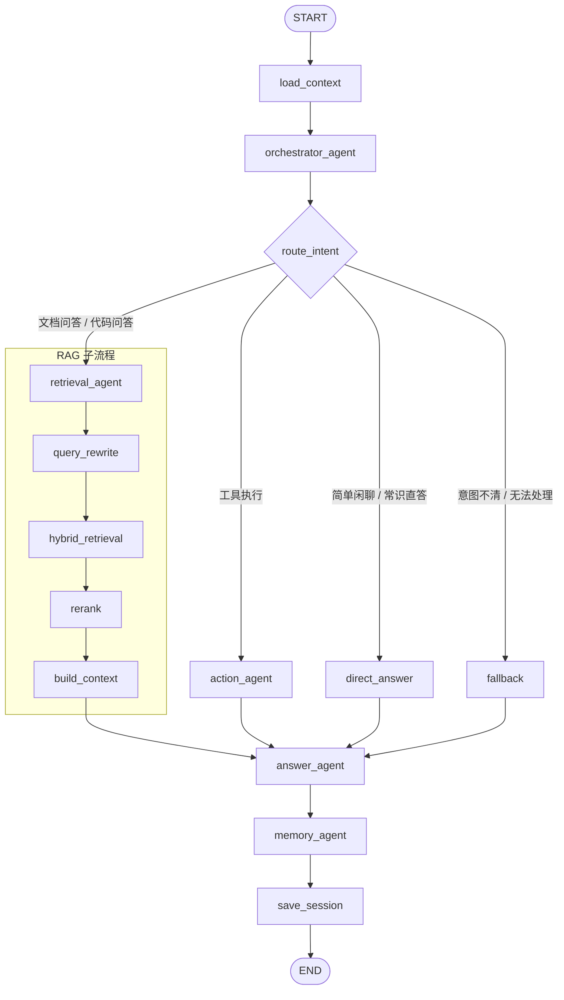

# 初步 Multi-Agent 结构图

下面这版先按 5 个核心 Agent 收敛，适合当前项目从 RAG 平滑演进到 LangGraph / Multi-Agent。



## 节点职责

- `orchestrator_agent`
  - 负责读取用户输入和会话上下文
  - 负责意图判断与链路分流
- `retrieval_agent`
  - 封装现有 RAG 能力
  - 内部继续走 `query_rewrite -> hybrid_retrieval -> rerank -> build_context`
- `action_agent`
  - 负责工具调用、外部接口执行、动作型任务
- `answer_agent`
  - 统一组织最终回复
  - 接收 RAG 证据、工具结果或降级结果
- `memory_agent`
  - 负责会话摘要、偏好提取、短期记忆保存
  - 建议异步化，避免阻塞主回答

## 和当前项目的映射

- `query_rewrite` 对应 `rag/query_rewrite.py`
- `hybrid_retrieval`、`rerank` 对应 `rag/retrieval.py`
- `build_context`、`answer_agent` 可复用 `rag/answering.py`
- `orchestrator_agent`、`action_agent`、`memory_agent` 是后续新增重点
```
